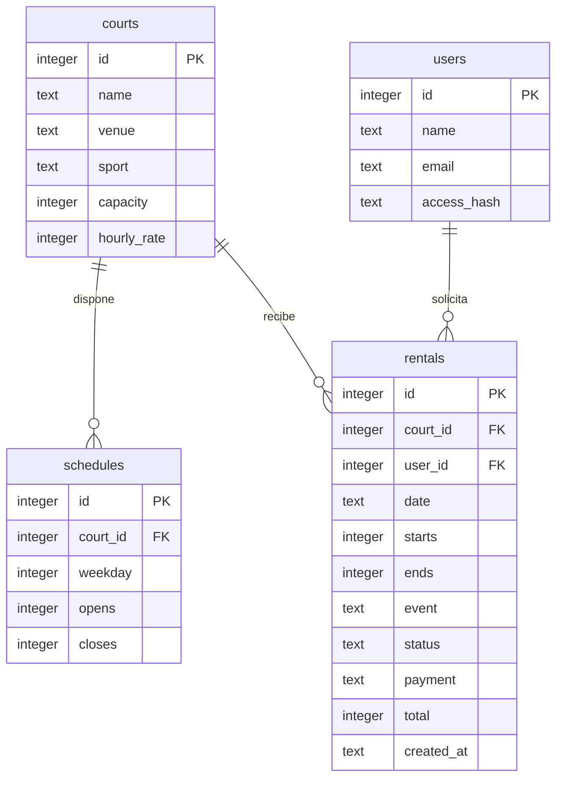
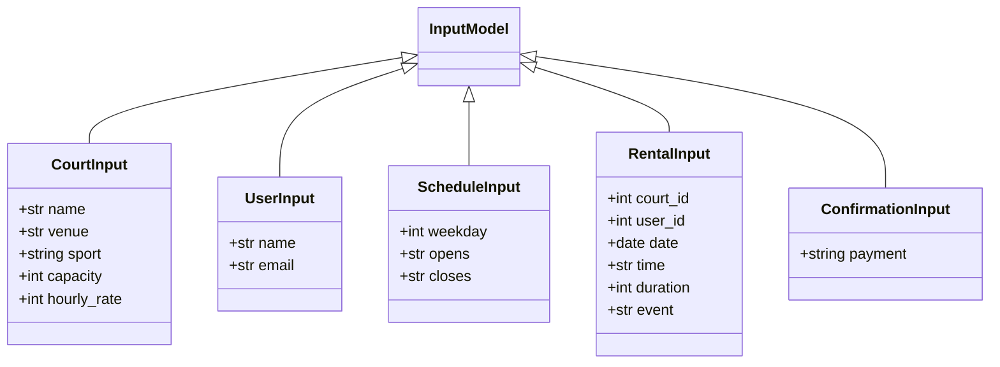
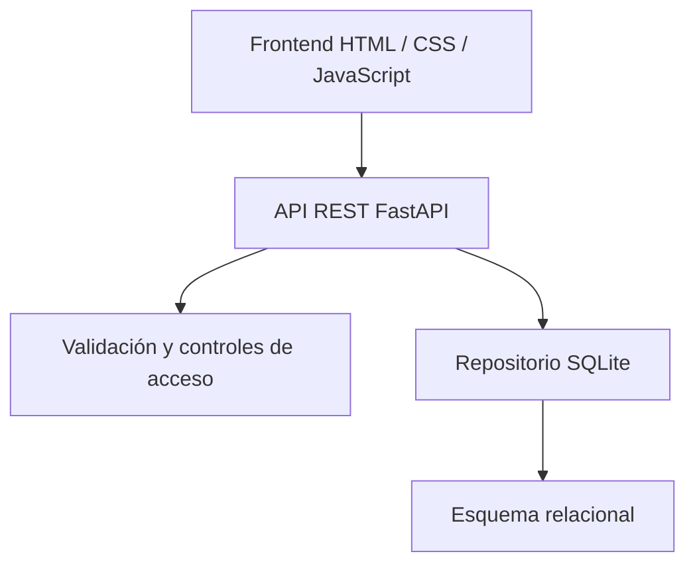
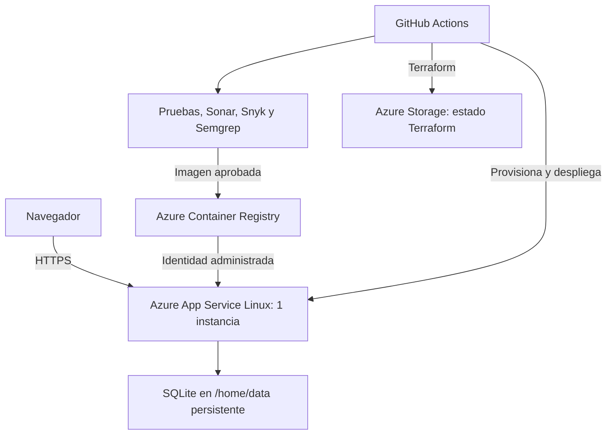

# Diagramas de la aplicación

Generados con scripts/generate_docs.py.

## Entidad relacion

```mermaid
erDiagram
  courts {
    integer id PK
    text name
    text venue
    text sport
    integer capacity
    integer hourly_rate
  }
  rentals {
    integer id PK
    integer court_id FK
    integer user_id FK
    text date
    integer starts
    integer ends
    text event
    text status
    text payment
    integer total
    text created_at
  }
  schedules {
    integer id PK
    integer court_id FK
    integer weekday
    integer opens
    integer closes
  }
  users {
    integer id PK
    text name
    text email
    text access_hash
  }
  courts ||--o{ schedules : dispone
  courts ||--o{ rentals : recibe
  users ||--o{ rentals : solicita
```

## Clases

```mermaid
classDiagram
  class InputModel {
  }
  class CourtInput {
    +str name
    +str venue
    +string sport
    +int capacity
    +int hourly_rate
  }
  InputModel <|-- CourtInput
  class UserInput {
    +str name
    +str email
  }
  InputModel <|-- UserInput
  class ScheduleInput {
    +int weekday
    +str opens
    +str closes
  }
  InputModel <|-- ScheduleInput
  class RentalInput {
    +int court_id
    +int user_id
    +date date
    +str time
    +int duration
    +str event
  }
  InputModel <|-- RentalInput
  class ConfirmationInput {
    +string payment
  }
  InputModel <|-- ConfirmationInput
```

## Componentes

```mermaid
flowchart TD
  UI["Frontend HTML / CSS / JavaScript"]
  API["API REST FastAPI"]
  AUTH["Validación y controles de acceso"]
  DB["Repositorio SQLite"]
  SQL["Esquema relacional"]
  UI --> API
  API --> AUTH
  API --> DB
  DB --> SQL
```

## Despliegue

```mermaid
flowchart TD
  U["Navegador"]
  GH["GitHub Actions"]
  Q["Pruebas, Sonar, Snyk y Semgrep"]
  ACR["Azure Container Registry"]
  WEB["Azure App Service Linux: 1 instancia"]
  HOME["SQLite en /home/data persistente"]
  STATE["Azure Storage: estado Terraform"]
  U -->|HTTPS| WEB
  GH --> Q
  Q -->|Imagen aprobada| ACR
  ACR -->|Identidad administrada| WEB
  WEB --> HOME
  GH -->|Terraform| STATE
  GH -->|Provisiona y despliega| WEB
```
